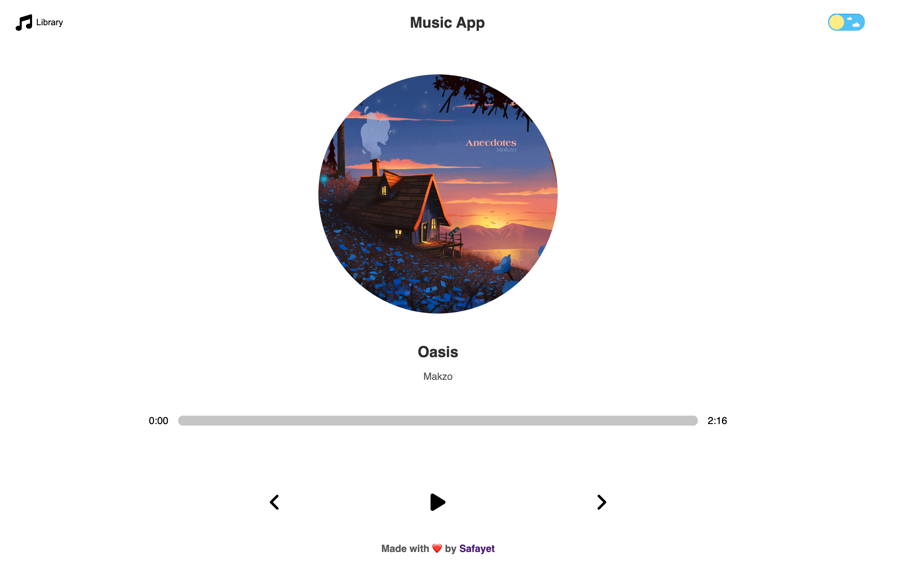
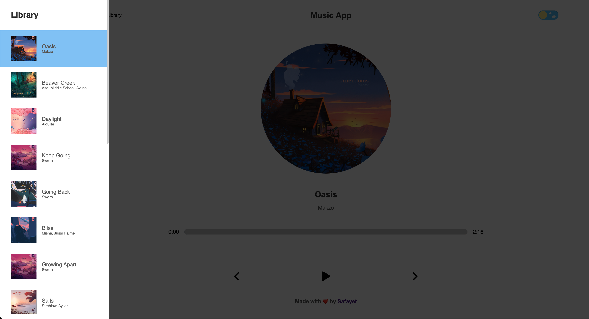
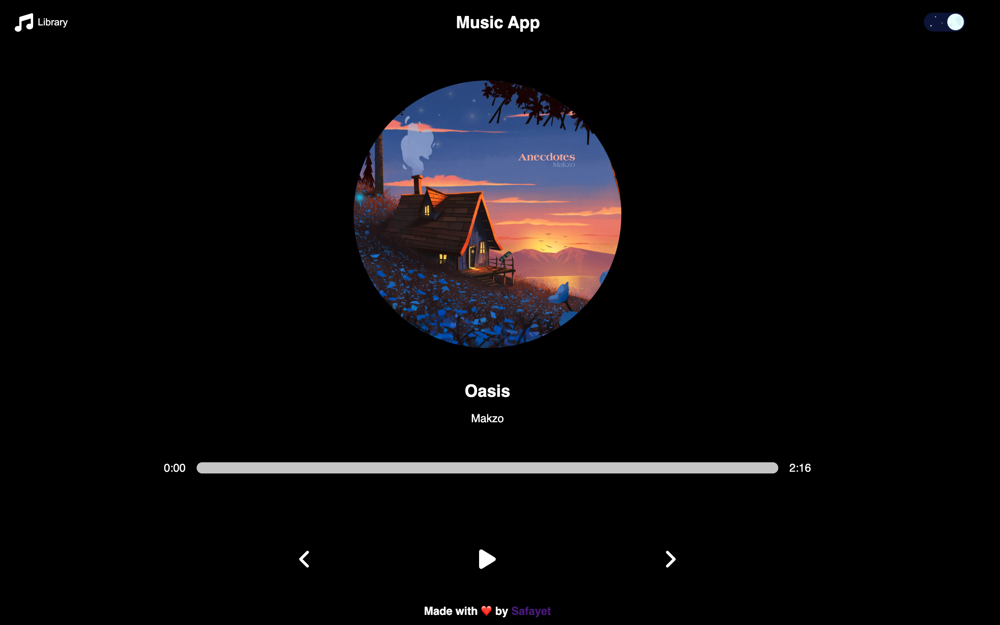
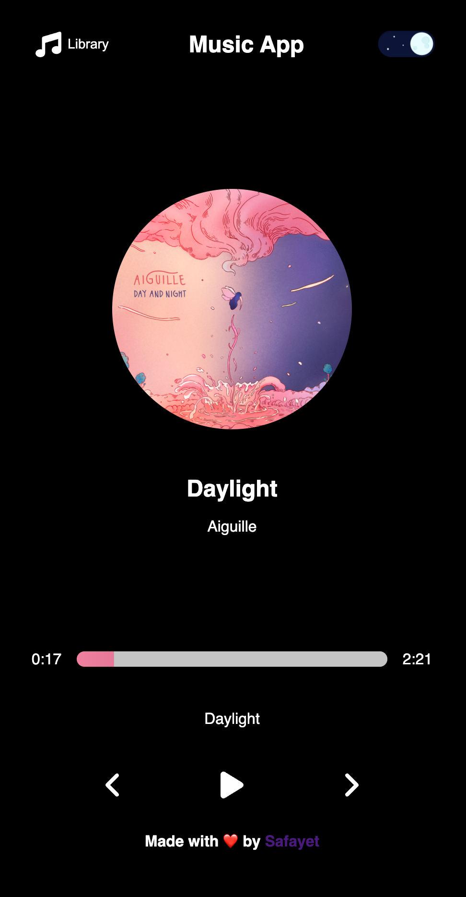
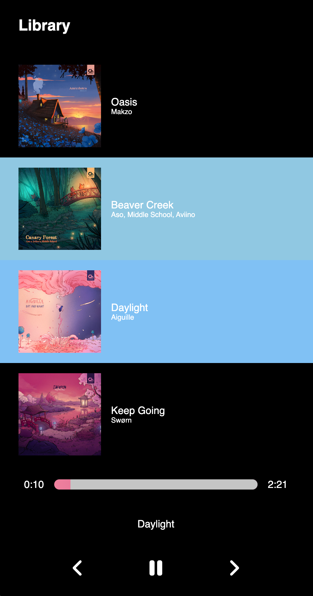

# Simple Music App with react typescript

- A Responsive Web-App to enjoy and chill Lofi Beats.
- Developed using React Typescript.
- Beautiful styling using SASS.
- Dark mode and light mode options
- Music Collected manually from [ChillHop](https://chillhop.com/) and stored in [playlist.ts](/src/music/playlist.ts).
- Deployed on Vercel.
- [Live DEMO](https://music-app-react-typescript.vercel.app/)

Screenshots:

 

  
Lightmode Desktop

  
   
  
Library Drawer

  
   
  
Darkmode Desktop

  
   
  
Darkmode Mobile

  
   
  
Library Drawer Mobile

  

